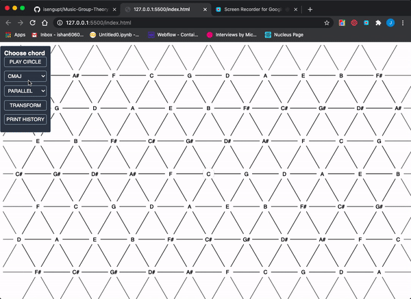
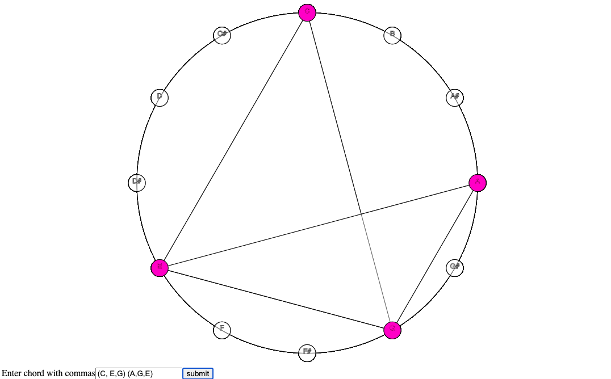

Simple visuals for tonnetz square and a circle of 12 semitones, along with javascript classes for converting chords using leading, relative, and parallel Neo-Riemannian transformations and uniform triadic transformations. Cube dance transformations also possible with the augmented triads class. 

